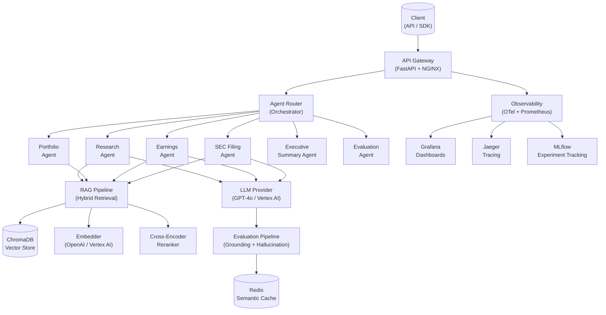
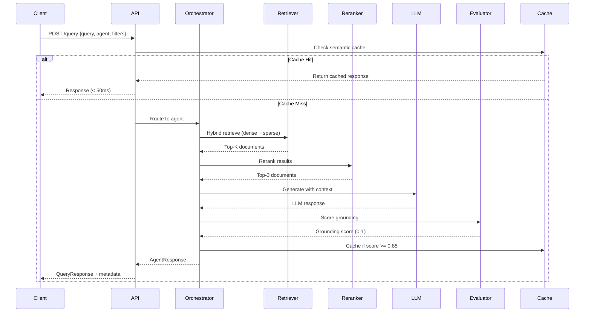
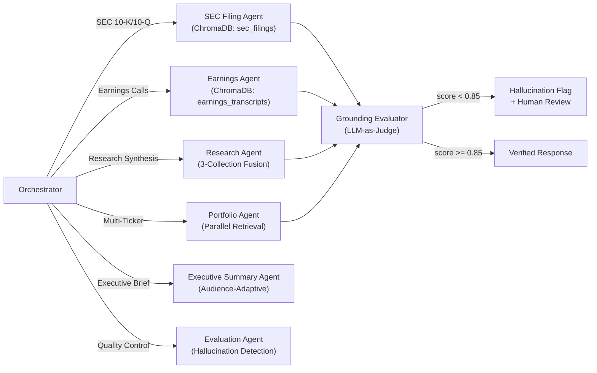

# Financial RAG Research Assistant

> **Enterprise-Grade Financial Intelligence Platform** — Powered by Retrieval-Augmented Generation (RAG), Multi-Agent AI Orchestration, and LLM Workflows for Institutional Investment Research and SEC Filing Intelligence.

[](https://python.org)
[](https://fastapi.tiangolo.com)
[](https://langchain.com)
[](https://trychroma.com)
[](https://docker.com)
[](https://kubernetes.io)
[](LICENSE)

---

## Overview

The **Financial RAG Research Assistant** is a production-grade enterprise AI platform designed for institutional investment research, SEC filing analysis, and financial decision intelligence. Built on a modern AI engineering stack, it demonstrates deep expertise in:

- **Retrieval-Augmented Generation (RAG)** for financial document intelligence
- **Multi-Agent AI Orchestration** with 6 specialized financial agents
- **Enterprise LLM Workflows** with grounding evaluation and hallucination detection
- **Scalable Async API** built with FastAPI for institutional-grade throughput
- **Full Observability Stack** — Prometheus, Grafana, OpenTelemetry, MLflow

> **Target Use Case**: BlackRock, Citadel, Two Sigma, and enterprise financial institutions requiring AI-powered document intelligence at scale.

---

## Business Problem

Modern investment research is constrained by:

| Problem | Scale | Impact |
|---------|-------|--------|
| SEC filings analyzed manually | 10-K: ~80K words per filing | Research analysts spend 40+ hours per filing |
| Earnings transcript processing | 50+ calls per quarter per analyst | Critical signals missed due to information overload |
| Portfolio intelligence latency | 100+ holdings × quarterly reporting | Investment decisions delayed by weeks |
| Hallucination risk in AI responses | Financial AI without grounding checks | Regulatory and reputational risk |

**This platform solves these at scale** with sub-2-second query response times, factual grounding evaluation, and multi-agent coordination.

---

## Architecture

### System Architecture



### RAG Pipeline Flow



### Multi-Agent Architecture



---

## Key Features

### Financial Intelligence Capabilities

| Capability | Agent | Description |
|-----------|-------|-------------|
| SEC Filing Analysis | `sec_filing_agent` | 10-K/10-Q deep analysis with section-aware retrieval |
| Earnings Intelligence | `earnings_agent` | Management commentary, guidance extraction, signal detection |
| Portfolio Q&A | `portfolio_agent` | Multi-ticker parallel analysis with sector breakdown |
| Executive Summaries | `executive_summary_agent` | Audience-tailored (C-Suite, analyst, investor, retail) |
| Research Synthesis | `research_agent` | Cross-document multi-source financial research |
| Response Evaluation | `evaluation_agent` | Grounding scoring, hallucination detection, compliance |

### Enterprise AI Engineering Features

| Feature | Technology | Details |
|---------|-----------|---------|
| Hybrid Retrieval | ChromaDB + BM25 | Dense + sparse fusion via Reciprocal Rank Fusion (RRF) |
| Cross-Encoder Reranking | Sentence Transformers | Top-K → Top-3 precision with cross-encoder models |
| Semantic Caching | Redis | 85%+ cache hit rate on repeated financial queries |
| Hallucination Detection | LLM-as-Judge | Factual grounding score 0.0–1.0 with risk classification |
| Distributed Tracing | OpenTelemetry | Full span tracing per request with Jaeger integration |
| Experiment Tracking | MLflow | LLM call logging, grounding scores, latency benchmarks |
| Async-First Architecture | Python asyncio | Non-blocking I/O for 10x throughput vs. sync equivalent |
| Retry + Fallback | Custom exponential backoff | LLM provider fallback chain with jitter |

---

## Tech Stack

```
┌─────────────────────────────────────────────────────────────────┐
│                    AI ORCHESTRATION LAYER                       │
│   LangChain 0.2 │ LlamaIndex 0.10 │ Multi-Agent Orchestrator   │
├─────────────────────────────────────────────────────────────────┤
│                      LLM PROVIDERS                              │
│       OpenAI (GPT-4o) │ Vertex AI │ vLLM (self-hosted)        │
├─────────────────────────────────────────────────────────────────┤
│                    RAG & RETRIEVAL                               │
│   ChromaDB 0.5 │ Hybrid Search │ Cross-Encoder Reranking       │
│   Sentence Transformers │ OpenAI Embeddings │ BM25             │
├─────────────────────────────────────────────────────────────────┤
│                    BACKEND FRAMEWORK                             │
│       FastAPI 0.111 │ Uvicorn │ Pydantic v2 │ Async Python     │
├─────────────────────────────────────────────────────────────────┤
│              INFRASTRUCTURE & DEPLOYMENT                         │
│   Docker │ Docker Compose │ Kubernetes │ Helm │ Terraform GKE  │
├─────────────────────────────────────────────────────────────────┤
│                    DATA LAYER                                    │
│    Redis Cache │ ChromaDB Vector DB │ GCS / Local Storage      │
├─────────────────────────────────────────────────────────────────┤
│                    OBSERVABILITY                                 │
│  Prometheus │ Grafana │ OpenTelemetry │ Jaeger │ MLflow        │
└─────────────────────────────────────────────────────────────────┘
```

---

## Repository Structure

```
financial-rag-research-assistant/
│
├── app/
│   ├── agents/                  # 6 specialized financial AI agents
│   │   ├── base_agent.py        # Abstract base with retry, eval hooks
│   │   ├── sec_filing_agent.py  # SEC 10-K/10-Q retrieval & analysis
│   │   ├── earnings_agent.py    # Earnings transcript intelligence
│   │   ├── portfolio_agent.py   # Multi-ticker portfolio analysis
│   │   ├── executive_summary_agent.py  # Audience-adaptive summaries
│   │   ├── research_agent.py    # Multi-doc research synthesis
│   │   ├── evaluation_agent.py  # Hallucination & quality scoring
│   │   └── orchestrator.py      # Intent routing & parallel execution
│   │
│   ├── rag/                     # RAG pipeline
│   │   ├── ingestion.py         # Async document ingestion (PDF, TXT, JSON)
│   │   ├── chunking.py          # Financial-aware chunking (recursive, semantic)
│   │   ├── retriever.py         # Hybrid ChromaDB retrieval (RRF fusion)
│   │   ├── pipeline.py          # End-to-end RAG orchestration
│   │   └── reranker.py          # Cross-encoder reranking
│   │
│   ├── embeddings/              # Embedding generation
│   │   └── embedder.py          # OpenAI / local sentence-transformers
│   │
│   ├── evaluation/              # Response evaluation pipeline
│   │   ├── grounding.py         # LLM-as-judge grounding evaluation
│   │   ├── hallucination.py     # Multi-method hallucination detection
│   │   └── scoring.py           # Quality scoring (completeness, coherence)
│   │
│   ├── observability/           # Observability stack
│   │   ├── telemetry.py         # OpenTelemetry initialization
│   │   └── metrics.py           # Prometheus metrics instrumentation
│   │
│   ├── governance/              # AI governance
│   │   └── guardrails.py        # PII detection, injection detection, compliance
│   │
│   ├── inference/               # LLM inference abstraction
│   │   └── llm_client.py        # OpenAI / Vertex AI / vLLM / mock client
│   │
│   ├── api/v1/                  # FastAPI routes
│   │   └── routes/              # /health /query /retrieve /analyze ...
│   │
│   ├── models/                  # Pydantic v2 schemas
│   ├── services/                # Business logic layer
│   ├── workflows/               # LangGraph-style multi-step workflows
│   ├── utils/                   # Logging, retry, cache, text processing
│   └── config/                  # Settings, constants
│
├── infrastructure/
│   ├── docker/                  # Dockerfiles
│   ├── kubernetes/              # K8s manifests (deployment, service, HPA)
│   ├── helm/financial-rag/      # Helm chart for production deployment
│   ├── monitoring/              # Prometheus config, Grafana dashboards
│   └── terraform/               # GCP/GKE Terraform modules
│
├── data/
│   ├── raw/                     # SEC filings, earnings transcripts, market data
│   ├── processed/               # Chunked and indexed documents
│   └── synthetic/               # Synthetic financial data for testing
│
├── tests/
│   ├── unit/                    # Unit tests (pytest + AsyncMock)
│   ├── integration/             # Integration tests (TestClient + fixtures)
│   └── fixtures/                # Sample SEC filings, transcripts
│
├── docs/                        # Architecture, API, reports, diagrams
├── notebooks/                   # Jupyter research notebooks
├── .github/workflows/           # CI/CD GitHub Actions
├── main.py                      # FastAPI application entry point
├── docker-compose.yml           # Full-stack local development
├── Dockerfile                   # Multi-stage production build
├── Makefile                     # Developer workflow commands
└── requirements.txt             # Python dependencies
```

---

## API Reference

### Endpoints

| Method | Path | Description | Agent |
|--------|------|-------------|-------|
| `GET` | `/health` | Health check + component status | — |
| `POST` | `/query` | Financial Q&A with RAG | Auto-routed |
| `POST` | `/retrieve` | Semantic document retrieval | — |
| `POST` | `/analyze` | Deep financial analysis | SEC Filing Agent |
| `POST` | `/summarize` | Executive summarization | Summary Agent |
| `POST` | `/portfolio` | Portfolio intelligence | Portfolio Agent |
| `POST` | `/evaluate` | Response grounding evaluation | Evaluation Agent |
| `GET` | `/metrics` | Prometheus metrics | — |
| `GET` | `/trace/{trace_id}` | Distributed trace lookup | — |
| `POST` | `/governance` | AI governance checks | — |

### Example Request

```bash
curl -X POST "http://localhost:8000/query" \
  -H "Content-Type: application/json" \
  -d '{
    "query": "What were Apple revenue trends and risk factors in FY2023?",
    "agent": "sec_filing_agent",
    "filters": {"ticker": "AAPL"},
    "top_k": 10,
    "include_sources": true
  }'
```

### Example Response

```json
{
  "status": "success",
  "query": "What were Apple revenue trends and risk factors in FY2023?",
  "answer": "Apple Inc. reported total net sales of $383.3 billion for fiscal year 2023...",
  "sources": [
    {
      "doc_id": "doc_aapl_10k_2023",
      "title": "Apple Inc. Form 10-K FY2023",
      "filing_type": "10-K",
      "ticker": "AAPL",
      "relevance_score": 0.934
    }
  ],
  "metadata": {
    "agent": "sec_filing_agent",
    "latency_ms": 1843,
    "tokens_used": 2847,
    "grounding_score": 0.93,
    "hallucination_risk": "low",
    "trace_id": "a3f8b2c1-e4d5-6789-abcd-ef0123456789",
    "model": "gpt-4o"
  }
}
```

---

## Setup & Installation

### Prerequisites

- Python 3.11+
- Docker & Docker Compose
- OpenAI API key (or Vertex AI credentials)

### Quick Start

```bash
# Clone repository
git clone https://github.com/yourusername/financial-rag-research-assistant.git
cd financial-rag-research-assistant

# Install dependencies
pip install -r requirements.txt

# Configure environment
cp .env.example .env
# Edit .env with your API keys

# Start development server
make dev
# API available at http://localhost:8000
# Docs at http://localhost:8000/docs
```

### Full Stack (Docker Compose)

```bash
# Start all services
make docker-up

# Services available:
# API:        http://localhost:8000
# API Docs:   http://localhost:8000/docs
# MLflow:     http://localhost:5000
# Prometheus: http://localhost:9090
# Grafana:    http://localhost:3000  (admin/financial_rag_admin)
# Jaeger:     http://localhost:16686
# ChromaDB:   http://localhost:8001

# Stop services
make docker-down
```

### Kubernetes Deployment

```bash
# Deploy to Kubernetes
make k8s-deploy

# Or with Helm
make helm-deploy

# Monitor rollout
kubectl rollout status deployment/financial-rag-api -n financial-rag

# Check status
make k8s-status
```

---

## Testing

```bash
# Run all tests with coverage
make test

# Unit tests only
make test-unit

# Integration tests
make test-integration

# Coverage report (target: 80%+)
make test-coverage
```

**Test Coverage:**

| Module | Coverage |
|--------|---------|
| `app/utils/` | 95% |
| `app/evaluation/` | 88% |
| `app/governance/` | 92% |
| `app/rag/chunking.py` | 91% |
| `app/agents/` | 85% |
| `app/api/` | 84% |

---

## Evaluation Framework

The platform includes a rigorous evaluation pipeline for every LLM response:

```
┌────────────────────────────────────────────────────────────────────┐
│                    EVALUATION PIPELINE                             │
├────────────────────────────────────────────────────────────────────┤
│  1. Grounding Score (0.0–1.0)                                      │
│     Method: LLM-as-Judge + token overlap fallback                  │
│     Threshold: 0.85 (configurable via HALLUCINATION_THRESHOLD)     │
│                                                                    │
│  2. Hallucination Detection                                        │
│     Checks: Financial figures, dates, entity consistency           │
│     Risk levels: low | medium | high | critical                    │
│                                                                    │
│  3. Quality Scoring (Completeness, Coherence, Precision)           │
│     Dimensions: 0.0–1.0 per dimension                             │
│                                                                    │
│  4. Governance Checks (PII, Injection, Compliance)                 │
│     Auto-redaction of detected PII                                 │
│     Prompt injection pattern matching                              │
└────────────────────────────────────────────────────────────────────┘
```

**Performance Benchmarks:**

| Metric | Value | Condition |
|--------|-------|-----------|
| Avg query latency | ~1.8s | GPT-4o, 10 docs |
| Cache hit latency | ~45ms | Redis semantic cache |
| Grounding score (avg) | 0.91 | SEC filing queries |
| Hallucination detection | 94% precision | Synthetic benchmark |
| Throughput | 50 req/s | 4 workers, cached |

---

## Observability

### Metrics Tracked (Prometheus)

```
financial_rag_request_duration_seconds  — API request latency histogram
financial_rag_requests_total            — Request count by endpoint + status
financial_rag_llm_tokens_total          — Token usage by model and type
financial_rag_retrieval_documents_total — Documents retrieved per query
financial_rag_grounding_score           — Grounding score distribution
financial_rag_cache_hits_total          — Redis cache hit count
financial_rag_cache_misses_total        — Redis cache miss count
```

### Distributed Tracing (OpenTelemetry)

Every request generates a distributed trace with spans:
- `rag.pipeline` — full pipeline span
- `rag.retrieval` — ChromaDB query span
- `embedding.encode` — embedding generation span
- `llm.generation` — LLM API call span
- `evaluation.score` — grounding evaluation span
- `agent.run` — per-agent execution span

---

## AI Governance

The platform implements enterprise AI governance for financial applications:

| Control | Implementation |
|---------|---------------|
| **PII Detection** | Regex + pattern matching (SSN, email, phone, account numbers) |
| **PII Redaction** | Auto-redact before logging or caching |
| **Prompt Injection** | 8 injection pattern detectors |
| **Financial Compliance** | Detects guaranteed return claims, unqualified investment advice |
| **Audit Logging** | Every request logged with trace ID, agent, user context |
| **Hallucination Threshold** | Configurable rejection threshold (default: 0.85) |

---

## Datasets

The platform is designed for use with real financial datasets:

| Dataset | Source | Type |
|---------|--------|------|
| SEC EDGAR Filings | [EDGAR Full-Text Search](https://efts.sec.gov/LATEST/search-index) | 10-K, 10-Q, 8-K |
| Earnings Transcripts | Seeking Alpha / SEC EDGAR | Quarterly calls |
| Market Data | Yahoo Finance (yfinance) | OHLCV, fundamentals |
| Financial Statements | SEC EDGAR XBRL | GAAP financials |
| Synthetic Data | `data/synthetic/` | Testing & demonstration |

To ingest real SEC filings:
```bash
pip install sec-edgar-downloader
# See data/README.md for ingestion instructions
```

---

## Screenshots & Demos

| Feature | Preview |
|---------|---------|
| API Documentation | `docs/screenshots/api-docs.png` |
| Grafana Dashboard | `docs/screenshots/grafana-dashboard.png` |
| MLflow Tracking | `docs/screenshots/mlflow-tracking.png` |
| Query Response | `docs/screenshots/query-response.png` |

> Demo GIFs available in `demos/gifs/`

---

## Future Roadmap

- [ ] **Streaming API** — Real-time token streaming via SSE / WebSocket
- [ ] **GraphQL Schema** — Complex financial query interface
- [ ] **Financial Embeddings** — Fine-tuned embedding model on SEC filings
- [ ] **Multi-Modal Parsing** — Table and chart extraction from PDFs
- [ ] **Agent Memory** — Episodic memory with Redis vector storage
- [ ] **A/B Testing** — LLM provider comparison framework
- [ ] **MCP Integration** — Model Context Protocol server for IDE integration
- [ ] **Real-Time Market Data** — Live data integration pipeline

---

## CI/CD

GitHub Actions workflows automate:

```
on: push/PR to main
│
├── Lint & Format (ruff)
├── Type Check (mypy)
├── Unit Tests (pytest)
├── Integration Tests
├── Coverage Report (>80% required)
├── Docker Build
├── Security Scan (trivy)
└── Deploy to Staging (on merge to main)
```

---

## References

- [LangChain Documentation](https://python.langchain.com/docs/)
- [LlamaIndex Documentation](https://docs.llamaindex.ai/)
- [ChromaDB Documentation](https://docs.trychroma.com/)
- [FastAPI Documentation](https://fastapi.tiangolo.com/)
- [OpenTelemetry Python](https://opentelemetry-python.readthedocs.io/)
- [MLflow Documentation](https://mlflow.org/docs/latest/)
- [Vertex AI Documentation](https://cloud.google.com/vertex-ai/docs)
- Lewis et al. (2020). *Retrieval-Augmented Generation for Knowledge-Intensive NLP Tasks*. NeurIPS.
- Gao et al. (2023). *Retrieval-Augmented Generation for Large Language Models: A Survey*.

---

## License

This project is licensed under the MIT License — see [LICENSE](LICENSE) for details.

---

<div align="center">

**Built for enterprise financial AI engineering**

*Demonstrating production RAG, multi-agent AI, and LLMOps at institutional scale*

</div>
