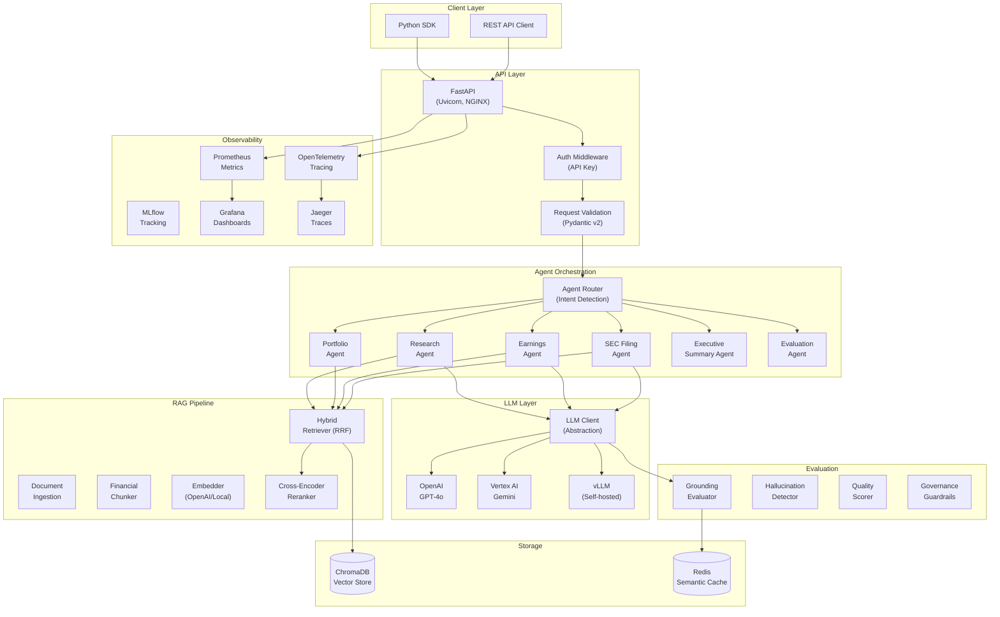
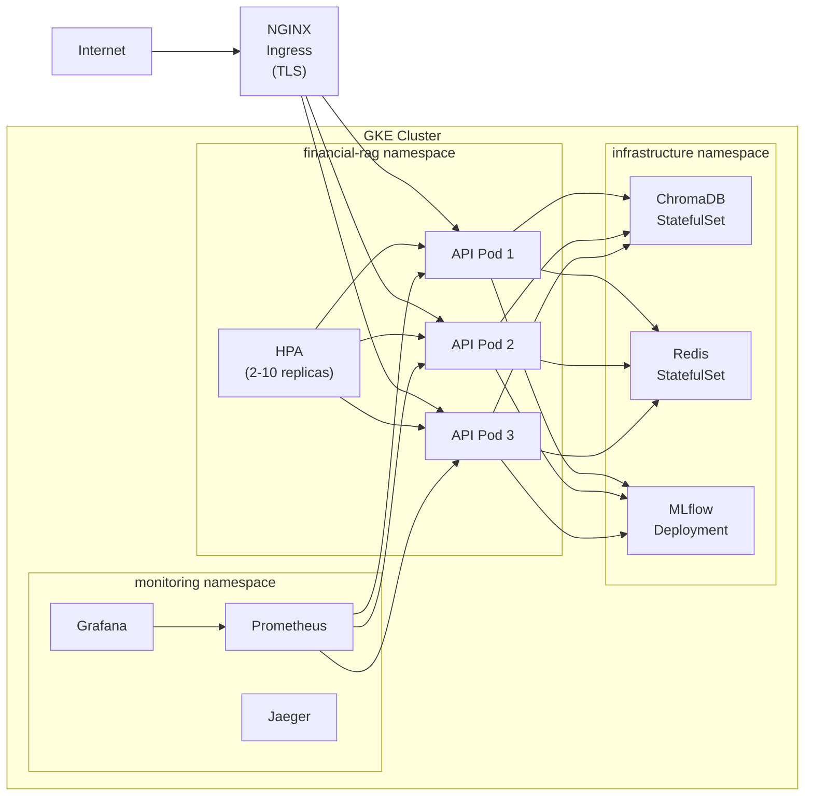

# Architecture Diagrams — Financial RAG Research Assistant

## Full System Architecture

```mermaid
graph TB
    subgraph Client Layer
        API_Client["REST API Client"]
        SDK["Python SDK"]
    end
    
    subgraph API Layer
        Gateway["FastAPI\n(Uvicorn, NGINX)"]
        Auth["Auth Middleware\n(API Key)"]
        Validation["Request Validation\n(Pydantic v2)"]
    end
    
    subgraph Agent Orchestration
        Router["Agent Router\n(Intent Detection)"]
        SEC["SEC Filing\nAgent"]
        Earn["Earnings\nAgent"]
        Port["Portfolio\nAgent"]
        Res["Research\nAgent"]
        Sum["Executive\nSummary Agent"]
        Eval["Evaluation\nAgent"]
    end
    
    subgraph RAG Pipeline
        Ingest["Document\nIngestion"]
        Chunk["Financial\nChunker"]
        Embed["Embedder\n(OpenAI/Local)"]
        Retrieve["Hybrid\nRetriever (RRF)"]
        Rerank["Cross-Encoder\nReranker"]
    end
    
    subgraph Storage
        ChromaDB[("ChromaDB\nVector Store")]
        Redis[("Redis\nSemantic Cache")]
    end
    
    subgraph LLM Layer
        LLMClient["LLM Client\n(Abstraction)"]
        OpenAI["OpenAI\nGPT-4o"]
        VertexAI["Vertex AI\nGemini"]
        vLLM["vLLM\n(Self-hosted)"]
    end
    
    subgraph Evaluation
        Grounding["Grounding\nEvaluator"]
        Halluc["Hallucination\nDetector"]
        Quality["Quality\nScorer"]
        Gov["Governance\nGuardrails"]
    end
    
    subgraph Observability
        Prometheus["Prometheus\nMetrics"]
        OTel["OpenTelemetry\nTracing"]
        MLflow["MLflow\nTracking"]
        Grafana["Grafana\nDashboards"]
        Jaeger["Jaeger\nTraces"]
    end
    
    API_Client & SDK --> Gateway
    Gateway --> Auth --> Validation --> Router
    Router --> SEC & Earn & Port & Res & Sum & Eval
    SEC & Earn & Port & Res --> Retrieve
    Retrieve --> ChromaDB
    Retrieve --> Rerank
    SEC & Earn & Res --> LLMClient
    LLMClient --> OpenAI & VertexAI & vLLM
    LLMClient --> Grounding
    Grounding --> Redis
    Gateway --> Prometheus & OTel
    OTel --> Jaeger
    Prometheus --> Grafana
```

## Deployment Architecture

```mermaid
graph LR
    subgraph GKE Cluster
        subgraph financial-rag namespace
            API1["API Pod 1"]
            API2["API Pod 2"]
            API3["API Pod 3"]
            HPA["HPA\n(2-10 replicas)"]
        end
        
        subgraph infrastructure namespace
            ChromaDB["ChromaDB\nStatefulSet"]
            Redis["Redis\nStatefulSet"]
            MLflow["MLflow\nDeployment"]
        end
        
        subgraph monitoring namespace
            Prometheus["Prometheus"]
            Grafana["Grafana"]
            Jaeger["Jaeger"]
        end
    end
    
    Internet --> NGINX["NGINX\nIngress\n(TLS)"]
    NGINX --> API1 & API2 & API3
    HPA --> API1 & API2 & API3
    API1 & API2 & API3 --> ChromaDB & Redis
    API1 & API2 & API3 --> MLflow
    Prometheus --> API1 & API2 & API3
    Grafana --> Prometheus
```
